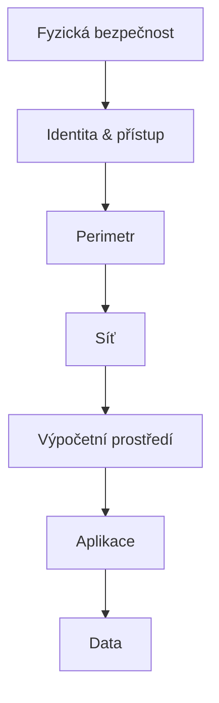

# Bezpečnost

    
---

## Autentizace a autorizace
Autentikace ověřuje identitu uživatele, zatímco autorizace určuje, k jakým zdrojům nebo akcím má tento uživatel přístup.

---

## Identity provider (IdP)
- Správa uživatelských účtů
- Zabezpečený přístup
- Autentizace uživatelů

---

## Hesla
- Hesla nepoužívat, tam kde to jde
- Silná a jedinečná hesla
- Pravidelná změna hesel
- Nesdílení hesel

---

## PIN
- Ve Windows (Windows Hello) PIN odemyká přihlášení jen na konkrétním zařízení
- PIN je navázaný na zařízení a chráněný lokálně (typicky přes TPM), neposílá se na server jako heslo
- PIN nenahrazuje úplně heslo účtu: heslo je stále potřeba např. při prvním nastavení, obnově účtu nebo přihlášení na novém zařízení
- PIN není přenositelný mezi zařízeními: na každém PC se nastavuje zvlášť
- Když útočník zná PIN, bez fyzického přístupu k danému zařízení ho obvykle nevyužije

---

## Vícefaktorová autentizace (MFA)
- Zvýšení bezpečnosti
- Riziko neoprávněného přístupu
- Biometrické ověření

---

## Biometrické ověření
- Otisky prstů
- Rozpoznávání obličeje
- Vyšší úroveň zabezpečení

---

## Jednorázová hesla (OTP)
- HOTP mění kód podle počtu použití (counter),
- TOTP mění kód podle času (např. každých 30 s).

---

## Hardwarové bezpečnostní klíče (FIDO/FIDO2)
- Fyzický klíč (např. USB/NFC) pro silné přihlášení
- Odolnost proti phishingu
- Privátní klíč neopouští zařízení, server dostává jen veřejný klíč
- Možné použití jako druhý faktor i bezheslové přihlášení (passkeys)
- Praktické je mít i záložní klíč pro případ ztráty

---

# Sítě

## Referenční model ISO/OSI
1. Fyzická vrstva  
2. Spojová vrstva  
3. Síťová vrstva  
4. Transportní vrstva  
5. Relační vrstva  
6. Prezentační vrstva  
7. Aplikační vrstva

---

## Firewall
- Ochranná zeď
- Kontrola přístupu
- Pravidelné aktualizace

---

# Hardware a software

## Hardware
- Ochrana fyzických zařízení

## Starý hardware
- Hardware nemusí být schopen „upočítat“ nejnovější šifrovací algoritmy

---

## Operační systémy (OS)
- Pravidelné aktualizace
- Zabezpečení uživatelských účtů

---

## Software
- Antivirový software
- Aktualizace softwaru
- Skenování systému

---

# VPN (Virtual Private Network)
- Šifrované spojení
- Bezpečný přenos dat
- Ochrana před odposlechem
- Skrytí IP adresy
- Vzdálený přístup / veřejná Wi‑Fi

---

# Šifry

## Symetrická vs. asymetrická kryptografie vs. hash
- Symetrické šifrování – jeden klíč
- Asymetrické šifrování – veřejný + privátní klíč
- Hashování – jedinečný otisk dat

---

## Veřejný a privátní klíč
- Veřejný klíč – šifrování
- Privátní klíč – dešifrování

---

## TLS
- Šifrování dat
- Ochrana citlivých informací
- Prevence útoků

### Přehled verzí SSL/TLS (podle roku vydání)
- SSL 2.0 – 1995 (zastaralé, nebezpečné)
- SSL 3.0 – 1996 (zastaralé, nebezpečné)
- TLS 1.0 – 1999 (zastaralé)
- TLS 1.1 – 2006 (zastaralé)
- TLS 1.2 – 2008 (dlouho standard)
- TLS 1.3 – 2018 (aktuálně doporučené)

---

## Certifikát a certifikační autority
- Funkce certifikátů
- Role CA

---

## Self‑signed certifikát a důvěra
- Certifikát podepsaný vlastní autoritou (ne CA), vhodný hlavně pro testování a interní prostředí
- Omezená důvěra

### Vytvoření 

*OpenSSL*

```bash
openssl req -x509 -newkey rsa:2048 -keyout key.pem -out cert.pem -days 365 -nodes
openssl pkcs12 -in cert.pfx -nocerts -out private.key -nodes`
openssl x509 -in cert.pem -pubkey -noout > public.key
```
*PowerShell*

```powershell
New-SelfSignedCertificate -DnsName "localhost" -CertStoreLocation "cert:\CurrentUser\My" -KeyExportPolicy Exportable
Export-PfxCertificate -Cert "cert:\CurrentUser\My\<THUMBPRINT>" -FilePath .\cert.pfx -Password (ConvertTo-SecureString "Heslo123!" -AsPlainText -Force)
```

---

# Hashování

## SHA‑256
- Moderní hashovací funkce
- Zajištění integrity dat
- Ochrana hesel

---

## HMAC‑SHA256
- Kombinace hashování a klíče
- Ověření integrity
- Autenticita zpráv

---

## Shared Access Signature (SAS)
- Omezený přístup k datům
- Dočasný přístup
- Podpis je typicky vytvořen pomocí HMAC‑SHA256

---

# Monitoring

## Metody monitoringu
- Sledování síťového provozu
- Logování událostí
- Analýza chování uživatelů

## Nástroje pro monitoring
- Správa logů
- Detekce anomálií
- SIEM systémy
- AI
