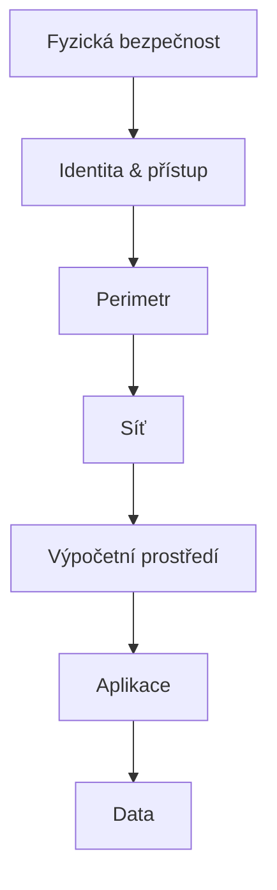

# Bezpečnost

    
---

## Autentizace a autorizace
Autentikace ověřuje identitu uživatele, zatímco autorizace určuje, k jakým zdrojům nebo akcím má tento uživatel přístup.

---

## Identity provider (IdP)
- Správa uživatelských účtů
- Zabezpečený přístup
- Autentizace uživatelů

---

## Hesla
- Silná a jedinečná hesla
- Pravidelná změna hesel
- Vyhnout se sdílení hesel

---

## PIN
- Zabezpečení pomocí PIN
- Silné a unikátní PINy
- Krátké vs. dlouhé PINy

---

## Biometrické ověření
- Otisky prstů
- Rozpoznávání obličeje
- Vyšší úroveň zabezpečení

---

## Jednorázová hesla (OTP, HOTP)
- Co jsou OTP
- Algoritmus HOTP

---

## Vícefaktorová autentizace (MFA)
- Zvýšení bezpečnosti
- Riziko neoprávněného přístupu
- Biometrické ověření

---

# Sítě

## Referenční model ISO/OSI
1. Fyzická vrstva  
2. Spojová vrstva  
3. Síťová vrstva  
4. Transportní vrstva  
5. Relační vrstva  
6. Prezentační vrstva  
7. Aplikační vrstva

---

## Firewall
- Ochranná zeď
- Kontrola přístupu
- Pravidelné aktualizace

---

# Hardware a software

## Hardware
- Ochrana fyzických zařízení

## Starý hardware
- Hardware nemusí být schopen „upočítat“ nejnovější šifrovací algoritmy

---

## Operační systémy (OS)
- Pravidelné aktualizace
- Zabezpečení uživatelských účtů

---

## Software
- Antivirový software
- Aktualizace softwaru
- Skenování systému

---

# VPN (Virtual Private Network)
- Šifrované spojení
- Bezpečný přenos dat
- Ochrana před odposlechem
- Skrytí IP adresy
- Vzdálený přístup / veřejná Wi‑Fi

---

# Šifry

## Symetrická vs. asymetrická kryptografie vs. hash
- Symetrické šifrování – jeden klíč
- Asymetrické šifrování – veřejný + privátní klíč
- Hashování – jedinečný otisk dat

---

## Veřejný a privátní klíč
- Veřejný klíč – šifrování
- Privátní klíč – dešifrování

---

## TLS
- Šifrování dat
- Ochrana citlivých informací
- Prevence útoků

---

## Certifikát a certifikační autority
- Funkce certifikátů
- Role CA

---

## Self‑signed certifikát a důvěra
- Co je self‑signed certifikát
- Zabezpečení komunikace
- Omezená důvěra

---

# Hashování

## SHA‑256
- Moderní hashovací funkce
- Zajištění integrity dat
- Ochrana hesel

---

## HMAC‑SHA256
- Kombinace hashování a klíče
- Ověření integrity
- Autenticita zpráv

---

## Shared Access Signature (SAS)
- Omezený přístup k datům
- Dočasný přístup

---

# Monitoring

## Metody monitoringu
- Sledování síťového provozu
- Logování událostí
- Analýza chování uživatelů

## Nástroje pro monitoring
- Správa logů
- Detekce anomálií
- SIEM systémy
